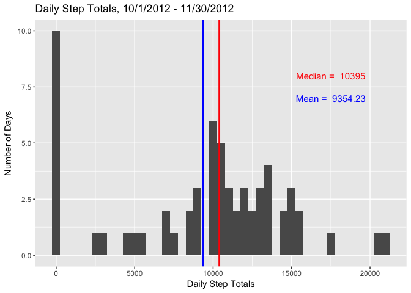
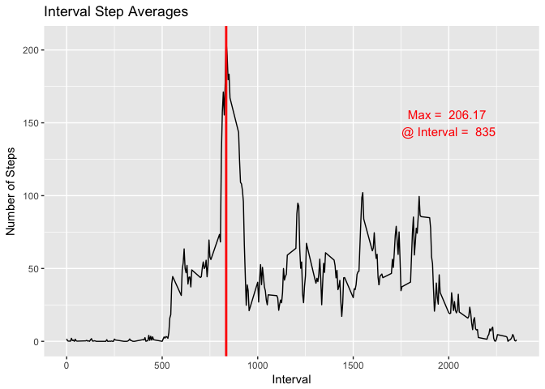
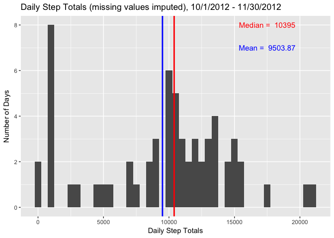
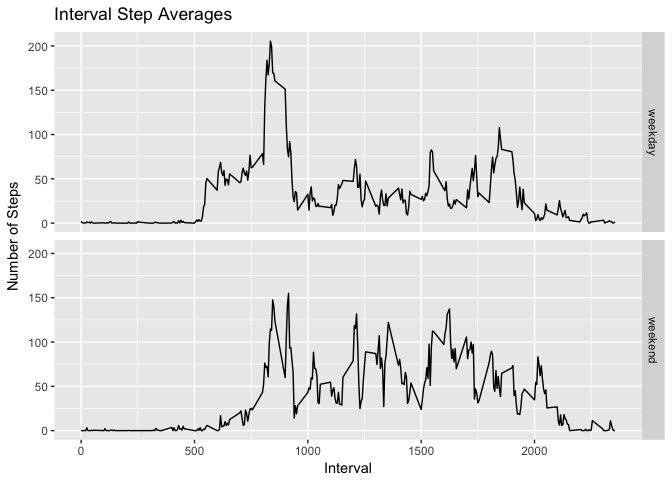

# Reproducible Research: Peer Assessment 1


## Loading and preprocessing the data
Load and preprocess the data as follows.

1. Load any required libraries. 
2. Assume the data exists in the current working directory as "activity.zip". Unzip the data file if needed.
3. Load the resulting .csv file into R. Note that the missing data is coded as NA, so set na.strings = "NA", and set strinsAsFactors = FALSE to read in dates as strings instead of factors. 
4. Convert the date column to dates using R package lubridate.


```r
   library(lubridate)
```

```
## 
## Attaching package: 'lubridate'
```

```
## The following object is masked from 'package:base':
## 
##     date
```

```r
   library(dplyr)
```

```
## 
## Attaching package: 'dplyr'
```

```
## The following objects are masked from 'package:lubridate':
## 
##     intersect, setdiff, union
```

```
## The following objects are masked from 'package:stats':
## 
##     filter, lag
```

```
## The following objects are masked from 'package:base':
## 
##     intersect, setdiff, setequal, union
```

```r
   library(ggplot2)

    # unzip the file if needed
    if (!file.exists("./foo.txt")) {
        unzip("./activity.zip", exdir="./")
    }
    # list directory contents -- extracted file is "activity.csv"
    dir()
```

```
##  [1] "activity.csv"                  "activity.zip"                 
##  [3] "doc"                           "figure"                       
##  [5] "instructions_fig"              "PA1_template_files"           
##  [7] "PA1_template.html"             "PA1_template.md"              
##  [9] "PA1_template.Rmd"              "README.md"                    
## [11] "RepData_PeerAssessment1.Rproj"
```

```r
    # load the .csv into R and convert date column to dates
    act <- read.csv("./activity.csv", stringsAsFactors = FALSE)
    act$date <- ymd(act$date)
    # call str() to check the format of the data frame
    str(act)
```

```
## 'data.frame':	17568 obs. of  3 variables:
##  $ steps   : int  NA NA NA NA NA NA NA NA NA NA ...
##  $ date    : Date, format: "2012-10-01" "2012-10-01" ...
##  $ interval: int  0 5 10 15 20 25 30 35 40 45 ...
```

A note on interval:

Interval values are read in as int from the data file. The format is (hh)mm on a 24 hour clock, so for example 12:10 am is encoded as 10, 1:10 am as 110, 10:10 am as 1010, 3:10 pm as 1510, etc. The interval values are left as int and used to group the data and as the independent variable in plots below. The last two digits range from 0 to 55, so the plots line plots will have "discontinuities" (not quite the right word) as there are no values between 60 to 95 for each hour.

## What is mean total number of steps taken per day?
For the initial analysis, ignore missing values. 

Use dplyr group_by() to group the data by day and summarize() to get the daily step totals.


```r
    act_by_date <- group_by(act, date)
    daily_step_totals <- summarize(act_by_date, "Total.Steps" = sum(steps, na.rm = TRUE))
```

Calculate the mean and median daily steps.


```r
    ds_median <- median(daily_step_totals$Total.Steps, na.rm = TRUE)
    ds_mean <- round(mean(daily_step_totals$Total.Steps, na.rm = TRUE),2)
```

Use ggplot2 to plot a histogram of daily step totals. 


```r
    d <- ggplot(daily_step_totals, aes(Total.Steps))
    d + geom_histogram(binwidth = 500) +
      xlab("Daily Step Totals") +
      ylab("Number of Days") +
      ggtitle("Daily Step Totals, 10/1/2012 - 11/30/2012") +
      geom_vline(xintercept=ds_median, color = "red", size = 1) + 
      geom_vline(xintercept=ds_mean, color = "blue", size = 1) +
      annotate("text",label=paste("Median = ",ds_median), x=17500, y=8, size=4, color = "red") +
      annotate("text",label=paste("Mean = ",ds_mean), x=17500, y=7, size=4, color = "blue")
```

<!-- -->

The median daily step total is 10395.

The mean daily step total is 9354.23.

## What is the average daily activity pattern?
Use dplyr group_by() to group the data by interval and summarize() to get the average steps per interval.


```r
    act_by_int <- group_by(act, interval)
    int_step_avg <- summarize(act_by_int, "Average.Steps" = mean(steps, na.rm = TRUE))
```

Compute the max value and the interval which contains the max.


```r
    as_max <- round(max(int_step_avg$Average.Steps, na.rm = TRUE),2)
    as_max_idx <- which.max(int_step_avg$Average.Steps)
    as_max_int <- int_step_avg$interval[as_max_idx]
```

Use ggplot to make a time series plot of average steps versus interval.


```r
    i <- ggplot(int_step_avg, aes(y=Average.Steps,x=interval))
    i + 
      geom_line() +
      xlab("Interval") +
      ylab("Number of Steps") +
      ggtitle("Interval Step Averages") +
      geom_vline(xintercept=as_max_int, color = "red", size = 1) +
      annotate("text",label=paste("Max = ", as_max, "\n@ Interval = ",as_max_int), x=2000, y=150, size=4, color = "red")
```

<!-- -->

Interval 835 contains the maximum step average of 206.17.

## Imputing missing values
Calculate the number of missing values in the activity dataset.


```r
    sum_NAs = sum(is.na(act$steps))
    print(paste("Number of missing values in original dataset = ",sum_NAs))
```

```
## [1] "Number of missing values in original dataset =  2304"
```

The total number of missing values in the activiy dataset = 2304.

The missing values can be imputed by replacing with the median across all days for that time interval. The impute.median() function is defined to impute missing value based on median. Then the pipeline operator is used to first group the data using dplyr group_by() and then apply the impute.median function to the grouped data using dplyr mutate().

Credit for this approach from [stackoverflow forums](http://stackoverflow.com/questions/9322773/how-to-replace-na-with-mean-by-subset-in-r-impute-with-plyr).


```r
    # Replace missing values with the interval median.
    # Create function to replace missing value with median.
    impute.median <- function(x) replace(x, is.na(x), median(x, na.rm = TRUE))
    # apply impute.median using dplyr group_by() and mutate()
    act_nm <- act %>% group_by(interval) %>% mutate(steps = impute.median(steps))
    # verify no missing values
    sum_NAs = sum(is.na(act_nm$steps))
    print(paste("Number of missing values in imputed dataset = ",sum_NAs))
```

```
## [1] "Number of missing values in imputed dataset =  0"
```

The total number of missing values in the activity dataset after mssing value imputation = 0.

Group and summarize the imputed data by date. Calculate the mean and median daily steps.


```r
    act_by_date_nm <- group_by(act_nm, date)
    daily_step_totals_nm <- summarize(act_by_date_nm, "Total.Steps" = sum(steps))
    ds_median_nm <- median(daily_step_totals_nm$Total.Steps)
    ds_mean_nm <- round(mean(daily_step_totals_nm$Total.Steps),2)
```

Use ggplot2 to plot a histogram of daily step totals on imputed data. 


```r
    dnm <- ggplot(daily_step_totals_nm, aes(Total.Steps))
    dnm + geom_histogram(binwidth = 500) +
      xlab("Daily Step Totals") +
      ylab("Number of Days") +
      ggtitle("Daily Step Totals (missing values imputed), 10/1/2012 - 11/30/2012") +
      geom_vline(xintercept=ds_median_nm, color = "red", size = 1) + 
      geom_vline(xintercept=ds_mean_nm, color = "blue", size = 1) +
      annotate("text",label=paste("Median = ",ds_median_nm), x=17500, y=8, size=4, color = "red") +
      annotate("text",label=paste("Mean = ",ds_mean_nm), x=17500, y=7, size=4, color = "blue")
```

<!-- -->

After imputing missing values, the median daily step total has not changed (as expected, since the imputation method was to replace a missing value with the interval median).

However, the mean daily step total has increased from 9354.23 to 9503.87. This is to be expected as the imputation method replaced a missing value with an interval median which will tend to push the daily totals higher. Note, for example that there were 10 days with 0 steps in the original data, and only 2 days with zero steps after imputing missing values. These 8 days have in the neighborhood of 1000 steps per day after imputation (2nd bar from left in the histogram).

## Are there differences in activity patterns between weekdays and weekends?

Determine the weekday from the date and add a Day.Type (weekend or weekday) column to the dataset. 


```r
    # First ungroup the activity data frame
    act_nm <- ungroup(act_nm)
    # define a function to extract the weekday/weekend factor from the date
    weekender <- function(x) {
        if_else((weekdays(x)=="Sunday"|weekdays(x)=="Saturday"),"weekend","weekday")
    }
    # mutate the dataframe to add a column indicating weekday/weekend
    act_nm <- mutate(act_nm, Day.Type = as.factor(weekender(date)))
    str(act_nm)
```

```
## Classes 'tbl_df', 'tbl' and 'data.frame':	17568 obs. of  4 variables:
##  $ steps   : int  0 0 0 0 0 0 0 0 0 0 ...
##  $ date    : Date, format: "2012-10-01" "2012-10-01" ...
##  $ interval: int  0 5 10 15 20 25 30 35 40 45 ...
##  $ Day.Type: Factor w/ 2 levels "weekday","weekend": 1 1 1 1 1 1 1 1 1 1 ...
```

Then group by interval and Day.Type and compute average number of steps per interval.


```r
    act_by_int_day = group_by(act_nm, interval, Day.Type)
    int_day_step_avg = summarize(act_by_int_day, "Average.Steps" = mean(steps))
```

Use ggplot2 to plot a panel plot comparing interval step averages for weekdays vs. weekends. 


```r
    inm <- ggplot(int_day_step_avg, aes(y=Average.Steps,x=interval))
    inm + geom_line() +
      xlab("Interval") +
      ylab("Number of Steps") +
      ggtitle("Interval Step Averages") +
      facet_grid(Day.Type~.)
```

<!-- -->

The activity patterns for weekends versus weekdays differ significantly. The weekday activity begins to climb just after 5:00 am (interval 500), while for the weekend the morning activity appears to start later. The morning peak activity between 8:00-9:00 am (interval 800-900) is significantly higher on weekdays (~200) versus weekends (~150), but the activity is generally higher on weekends between intervals 1000-1750 (mid-day) and after interval 2000 (8:00 pm).
